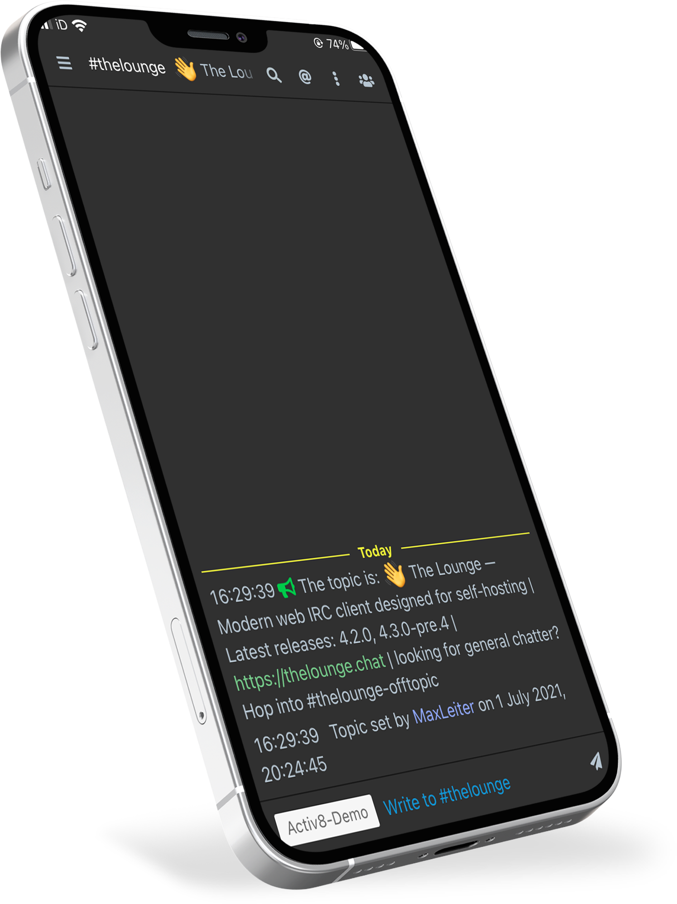

<h1 align="center">
	
</h1>

<h3 align="center">
	A simple flat theme with dark colours
</h3>

<p align="center">
	<a href="https://demo.thelounge.chat/"></a>
	<a href="https://www.npmjs.com/package/thelounge-theme-flat-dark"></a>
	<a href="https://npm-stat.com/charts.html?package=thelounge-theme-flat-dark"></a>
	<a href="https://github.com/aab12345/thelounge-theme-flat-dark/actions/workflows/publish.yml"></a>	
</p>

<p align="center">
	
</p>

<p align="center">
	
</p>

[NPM Package Page](https://www.npmjs.com/package/thelounge-theme-flat-dark)
## Installation :sparkles:
Install this theme with npm:

```sh
thelounge install thelounge-theme-flat-dark
```

## Issues :sparkles: <a href="https://github.com/aab12345/thelounge-theme-flat-dark/issues?q=is%3Aopen+is%3Aissue"> </a> <a href="https://github.com/aab12345/thelounge-theme-flat-dark/issues?q=is%3Aissue+is%3Aclosed"> </a> <br />
If you have an issue, change request or comments about this theme please report it below:<br/>
<a href="https://github.com/aab12345/thelounge-theme-flat-dark/issues">/thelounge-theme-flat-dark/issues</a>
